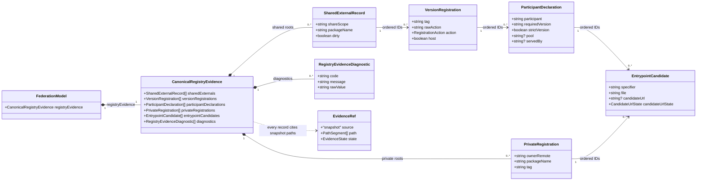
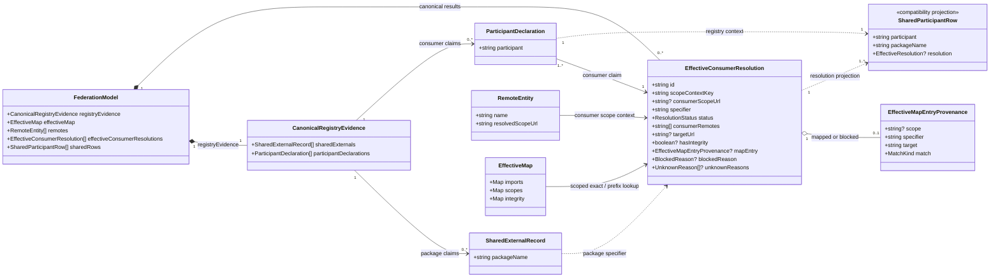

# Native Federation DevTools

A read-only Chrome DevTools extension for inspecting [Native Federation](https://native-federation.com)
applications: remotes and exposes, shared-dependency resolution, and the
effective import map — with honest evidence states instead of guesses.

> Community project. Not officially affiliated with Native Federation.

**Status:** pre-release, under active development. The Packages and Remotes
tabs are implemented; Import Map and Diagnostics currently render placeholders.

## Why

In a micro-frontend setup with mixed framework versions, the interesting
questions are hard to answer from the outside: *Which version of
`@angular/core` won? Who provided it? Why did this remote end up with its own
copy?* The negotiation happens once at startup and then disappears into the
import map. This extension reads the result back out and explains it.

## What it shows

**Packages** — per-package negotiation detail: every candidate version with
its outcome (shared, scoped, or skipped), the requesting participant and its
range, strict requirements, and which participant provides the mapped entry.
Conflicts are listed separately. Includes SRI coverage and chunk mapping where
the capture provides it.

**Remotes** — the same data from each participant's point of view: exposes
with their mapped targets, the remote's own dependency declarations and where
each one resolves, capability evidence (SRI, dense chunking), chunk
attribution, and scoped externals.

Any snapshot can be exported as JSON, which doubles as a reproducible bug
report.

In progress: **Import Map** (the effective map with attribution per row),
**Diagnostics** (registry↔map lint), and global search. The data layer behind
them is in place — the views are not.

## Design constraints

**Read-only by construction.** The extension inspects without invoking getters
or triggering side effects — it never mutates the application it is pointed
at. This is enforced by tests in `guards/`, not by convention.

**Explicit about what it cannot know.** Where the runtime data proves
resolution but not intent, the UI says so instead of inferring. Derived values
are labelled (`source-derived`); missing chunk evidence is stated rather than
silently omitted.

**No permissions.** The manifest requests none — no host permissions, no
content scripts. The panel talks to the inspected page through the DevTools
API only.

## Resolution data model

One captured `SnapshotV1` becomes one `FederationModel`. The Store keeps the
captured registry declarations, remote scope URLs, and import-map evidence
separate until `resolveEffectiveConsumerBindings` joins them. The diagrams show
the resolution-relevant part of that model in two focused views maintained next
to each other: captured registry evidence first, effective resolution second.

| Layer                  | Snapshot source                                         | Store representation            |
| ---------------------- | ------------------------------------------------------- | ------------------------------- |
| Registry declarations  | `runtime.sharedExternals` and `runtime.scopedExternals` | `CanonicalRegistryEvidence`     |
| Consumer scope context | `runtime.remotes`                                       | `RemoteEntity[]`                |
| Import-map rules       | `importMaps.documentMaps`                               | `EffectiveMap`                  |
| Canonical result       | The three inputs above plus `channels.domImportMaps`    | `EffectiveConsumerResolution[]` |
| Existing view contract | Registry evidence plus canonical results                | `SharedParticipantRow[]`        |

### 1. Registry evidence

This view answers _who declared what?_ `CanonicalRegistryEvidence` stores the
records as flat, ordered arrays. The arrows show their logical parent/child ID
relationships; no winner or effective file is selected here.



### 2. Effective consumer resolution

This view answers _where would that declaration resolve at the consumer's
scope root?_ The package name, consumer, normalized remote scope URL, and
effective import map meet only in `EffectiveConsumerResolution`. The scope URL
is a lookup context, not an observed importer-module URL.



Read the two views from evidence to result: `normalizeRegistryEvidence` retains
every captured declaration and its snapshot paths; `mergeDocumentMaps`
normalizes the document tags into one `EffectiveMap`; remote scope URLs provide
the scope-root lookup context. The resolver groups claims with the same scope
context and package and records exactly one honest outcome. Modules under a
more specific map scope or outside the remote scope can resolve differently:

- `mapped` means a matching, valid import-map binding supplies the normalized
  target.
- `unmapped` means the map and consumer scope context are known, but no
  applicable import-map binding exists.
- `blocked` means a matching binding exists, but its target is unusable (for
  example an invalid URL or prefix expansion); the entry and exact reason are
  retained.
- `unknown` means the map channel or consumer scope evidence is missing.

`SharedParticipantRow` is only a one-way projection for existing views. It is
never input to canonical resolution. A mapped result describes what the
captured map would bind — not the browser's complete URL fallback behavior, nor
what it requested, downloaded, or executed. In particular, a URL-like
specifier without a matching map entry remains `unmapped` here even though the
browser can resolve that URL without an import-map binding. The
registry-specific rationale and invariants remain in the
[Task 1 design notes](docs/work/resolution-model/task-1-domain-model.md), without
another copy of the diagrams.

## Install (development build)

```bash
npm install
npm run build:extension
```

Then in Chrome: `chrome://extensions` → enable **Developer mode** → **Load
unpacked** → select the built extension directory. Open DevTools on any Native
Federation application; the panel appears as a new tab.

## Development

```bash
npm start        # dev panel in the browser, with fixtures
npm test         # UI, bridge, collector, and guard suites
```

The dev panel can replay captured scenarios without a running application via
`?fixture=<id>` — strict share scopes, split versions across remotes, scope
isolation, dynamic initialization, and a live capture of a deployed
Angular/React host.

## Repository layout

| Path | Contents |
| --- | --- |
| `extension/` | MV3 manifest and DevTools page |
| `projects/` | collector, bridge, and UI libraries |
| `captures/` | raw runtime captures and the corpus manifest |
| `guards/` | invariant tests, including the privacy scan |
| `docs/` | specs and validation reports |
| `scripts/` | capture, fixture derivation, and build tooling |

Captures are lab data of this project's own scenario runner and its own
deployed demo application only — never third-party pages. See
[`captures/README.md`](captures/README.md) for the corpus policy, provenance,
and regeneration steps.

The product boundary is defined in
[`docs/specs/native-federation-devtools.md`](docs/specs/native-federation-devtools.md).

## License

MIT
