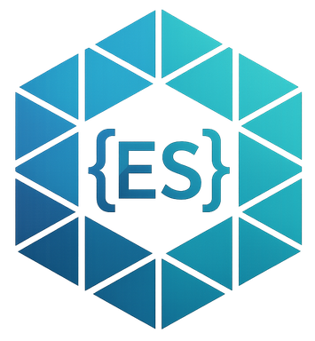
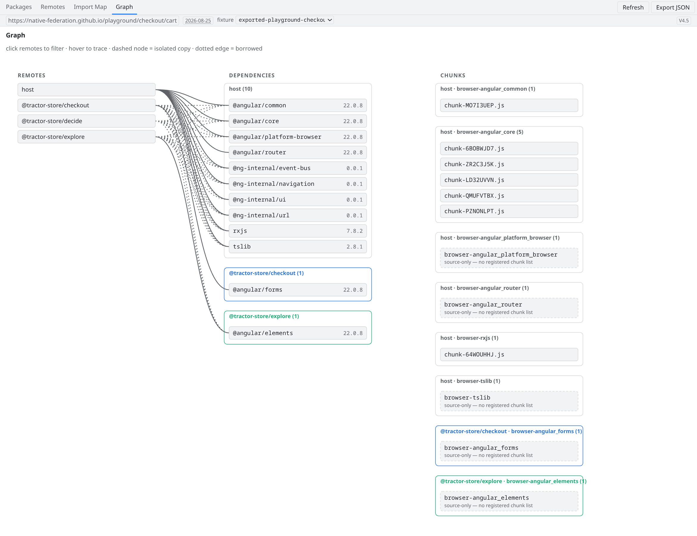
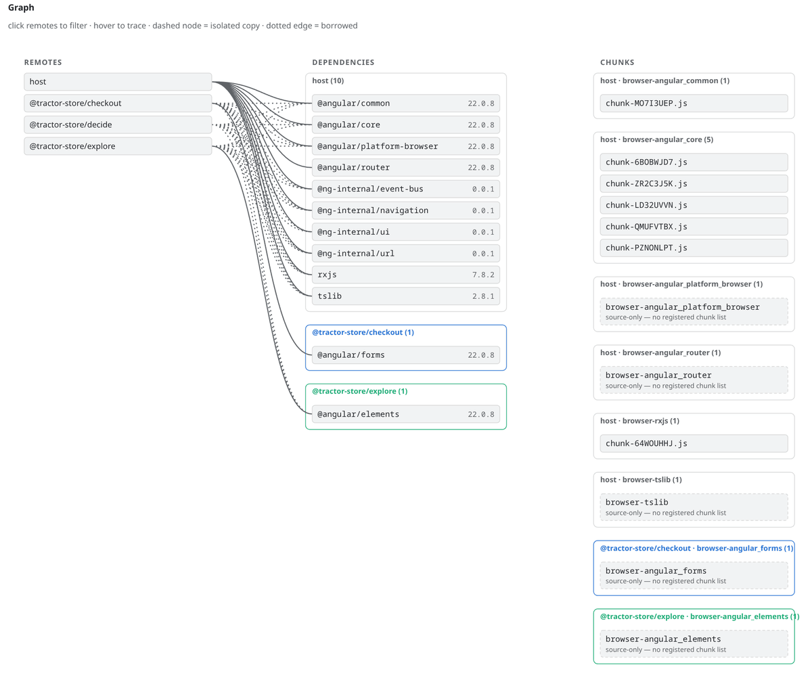
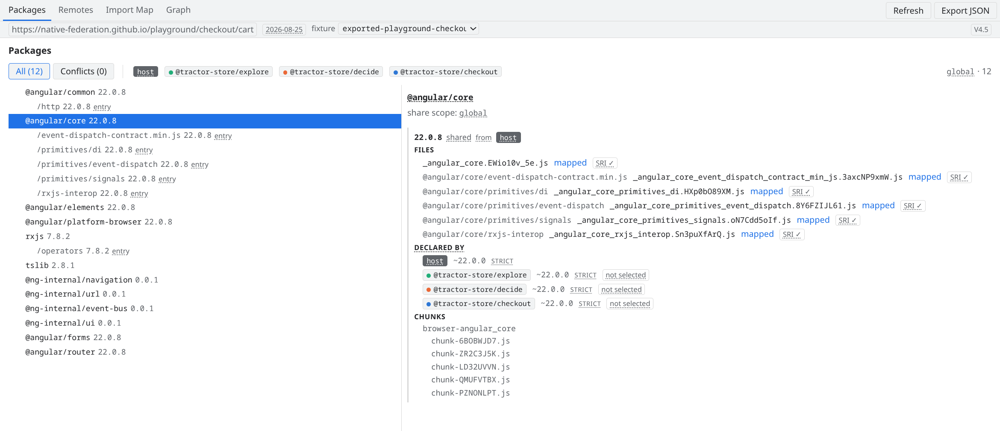
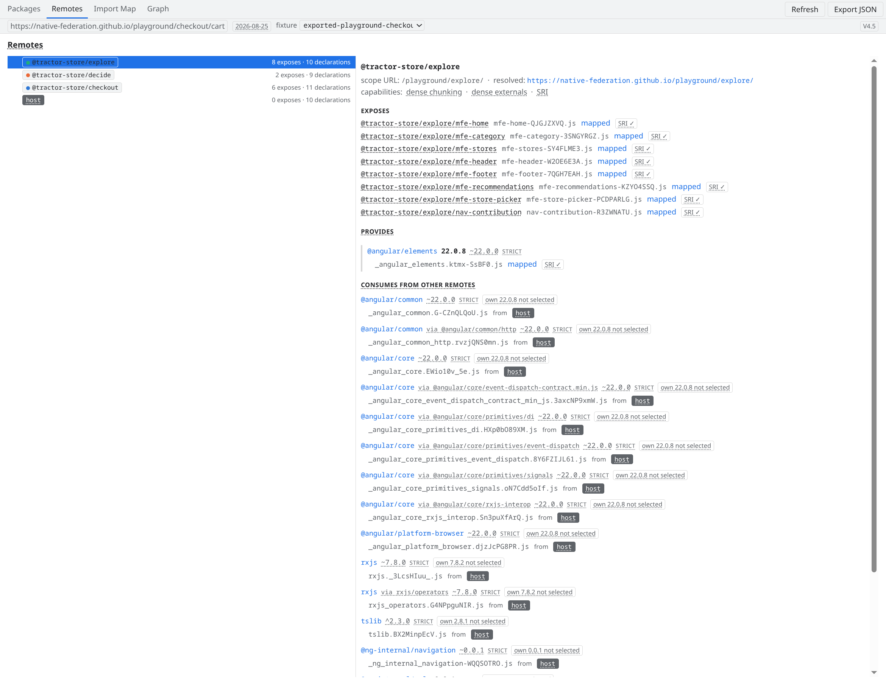

<div align="center">



# Native Federation DevTools

**See what your micro frontends actually negotiated.**

A read-only Chrome DevTools panel for [Native Federation](https://native-federation.com) applications.


<picture>
  <source media="(prefers-color-scheme: dark)" srcset="docs/assets/readme/hero-graph-dark.png">
  
</picture>

</div>

> *Which version of `@angular/core` won? Who provided it? Why did that remote
> end up with its own copy?*

The negotiation happens once at startup — then it disappears into the import
map. Native Federation DevTools reads it back out of the running page and
explains it: every shared package, every remote, every chunk. Evidence, not
guesses.

## What you get

- 📦 **Packages** — the negotiation, per package: every candidate version, who
  declared which range, which file actually serves it. Conflicts are called
  out, not averaged away.
- 🛰️ **Remotes** — each participant from its own point of view: what it
  exposes, what it declares, and where every single dependency really
  resolves.
- 🕸️ **Graph** — remotes, dependency copies, and chunks as one traceable
  picture. Hover to trace, click to filter.
- 🗺️ **Import Map** — the effective map, row by row, each entry attributed
  to its package, its provider, and the chunk bundle that serves it.
- 📤 **Export JSON** — freeze the entire snapshot to a file. Doubles as a
  reproducible bug report.
- 🔒 **Read-only, zero permissions** — no host permissions, no content
  scripts. The panel inspects; it never mutates the page. Enforced by tests,
  not by convention.

In progress: **Diagnostics** (registry↔map lint) and global search.

## Hover to trace

One hover answers *"who shares this — and which files does it load?"*

<picture>
  <source media="(prefers-color-scheme: dark)" srcset="docs/assets/readme/hover-trace-dark.gif">
  
</picture>

Dashed nodes are isolated copies, dotted edges are borrowed dependencies —
the sharing story is visible at a glance.

## Every negotiation, explained

<picture>
  <source media="(prefers-color-scheme: dark)" srcset="docs/assets/readme/packages-dark.png">
  
</picture>

Four participants declared `@angular/core` — one version won, three were not
selected, and every mapped file is accounted for, SRI included.

## Every remote, from its own point of view

<picture>
  <source media="(prefers-color-scheme: dark)" srcset="docs/assets/readme/remotes-dark.png">
  
</picture>

Exposes, provided packages, and — line by line — which dependency this remote
consumes from whom, and which own version lost the negotiation.

## Install

🛒 **Chrome Web Store: coming soon** — the extension will be published under
the official Native Federation presence.

Until then, load a development build:

```bash
npm install
npm run build:extension
```

Then in Chrome: `chrome://extensions` → enable **Developer mode** → **Load
unpacked** → select the built extension directory. Open DevTools on any
Native Federation application — the panel appears as a new tab.

## Native Federation ecosystem

| Project | What it is |
| --- | --- |
| [native-federation.com](https://native-federation.com) | Project home — docs, guides, team, resources |
| [orchestrator](https://github.com/native-federation/orchestrator) | Runtime micro frontend orchestrator |
| **devtools** (this repo) | Chrome DevTools panel for inspecting running federations |

## Documentation

- [Development & Architecture](docs/DEVELOPMENT.md) — build, run, test,
  repository layout, and the design constraints behind the tool
- [Resolution data model](docs/resolution-data-model.md) — how a captured
  snapshot becomes the model behind the views

## About

Developed and maintained by [Lutz Leonhardt](https://lutzleonhardt.de) as
part of the official Native Federation project.

Built in an agentic workflow with Claude Code and Codex as pair programmers —
architecture, review, and verification stay with the maintainer.

Licensed under [MIT](LICENSE).
