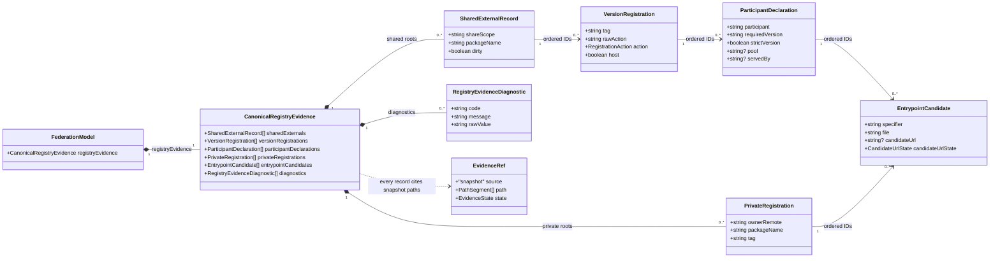
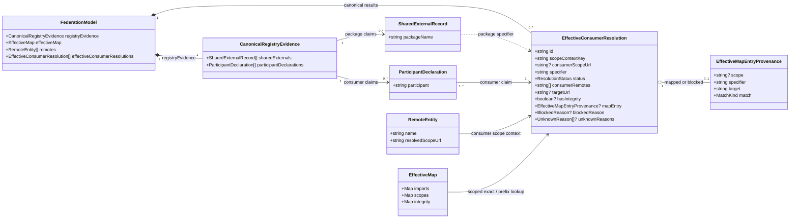
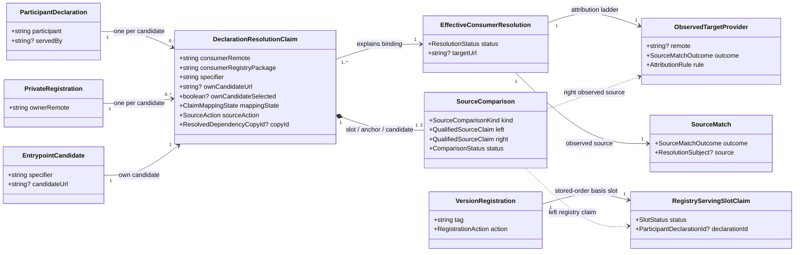
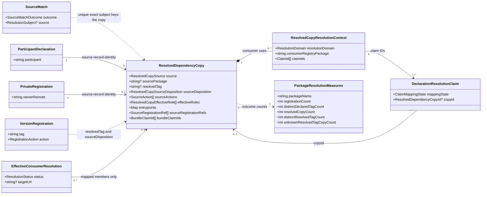

# Resolution data model

This is the maintained model documentation of the DevTools resolution
pipeline: first the big picture and the view-model boundary beneath it, then
the five detailed class-diagram views of the store model. The normative
contract behind it is
[the resolution-model specification](specs/native-federation-resolution-model.md);
this document describes what the code implements today.

## The big picture

The whole system answers one question:

> A probe records what the page really declared. From that, pure functions
> compute: **which package lands where for which consumer — and why?**

Everything else is four stages, each answering exactly one question and each
adding one guarantee:

```mermaid
flowchart LR
  subgraph observe ["1 · Observe"]
    snapshot["SnapshotV1<br/>raw, sanitized facts"]
  end
  subgraph order ["2 · Order"]
    evidence["CanonicalRegistryEvidence<br/>every raw row addressable"]
  end
  subgraph derive ["3 · Derive"]
    resolutions["EffectiveConsumerResolution<br/>what does the map deliver?"]
    claims["Claims<br/>how does each registry row explain that?"]
    copies["ResolvedDependencyCopy<br/>how many material copies exist?"]
    bundles["Bundle and chunk claims<br/>which chunks belong to them?"]
  end
  subgraph publish ["4 · Publish"]
    projection["CanonicalResolutionProjection<br/>one raw-free read surface"]
  end

  page["Page runtime +<br/>import maps"] --> snapshot
  snapshot --> evidence
  evidence --> resolutions --> claims --> copies --> bundles --> projection
  projection --> views["Views and any future graph"]
```

1. **Observe** — the collector probe reads the Native Federation globals and
   document import maps and stores them as a `SnapshotV1`: sanitized, but
   never interpreted. What was absent stays absent.
2. **Order** — ingest normalizes the raw repositories into
   `CanonicalRegistryEvidence`: every raw row gets a deterministic ID and
   provenance. Nothing is merged, de-duplicated, or decided here.
3. **Derive** — a chain of pure functions computes the answer in four
   sub-questions: the import-map outcome per consumer and specifier (the
   atomic truth, with honest `mapped | unmapped | blocked | unknown`
   states), the claim explanations of every registry row against that
   outcome, the materially resolved dependency copies, and the bundle/chunk
   attribution. Nothing at this stage guesses: ambiguity stays visible as
   data.
4. **Publish** — one raw-free `CanonicalResolutionProjection` on the store
   model is the single surface views (and any future graph) read. No view
   re-derives winners, copy counts, or chunk ownership.

One boundary holds everywhere: the model proves what the captured import map
**resolves** — never that the browser requested, downloaded, cached, or
executed anything.

## The view-model boundary

The projection is the model's publication format, not a render format: flat,
normalized collections that reference each other only by canonical ID, and
deliberately pivot-neutral. Each view therefore keeps one thin, pure
view-model builder (for example `buildPackagesVm`) between the projection and
its template. That layer exists for exactly two jobs:

- **Joining and pivoting.** Templates cannot join by ID. The builder indexes
  the three read surfaces once (`resolutionProjection`,
  `effectiveConsumerResolutions`, `registryEvidence`) and folds them into the
  view's shape: Packages pivots the consumer → copy → chunk spine on the
  package, Remotes pivots it on the consumer, Import Map on the map entries,
  a future graph on all edges. Because several presentations read the one
  truth, the projection must stay pivot-neutral — baking any render shape
  into it would color canonical evidence with UI decisions.
- **Presentation judgements.** Display vocabulary and wording
  (`skipped own 1.0.0`, `mapped only for X`), deviation-first choices (what
  is a chip, what is a tooltip), ordering (elected copy first), and view-level
  indicators such as the resolved-tag-multiplicity glyph are view decisions,
  not domain facts — the actual conflict judgement belongs to diagnostics.

The boundary rule is strict in both directions and testable: a view-model
builder **groups and labels precomputed knowledge — it derives nothing new**.
It never computes winners, copy counts, roles, or chunk ownership; every
field it emits chains to a canonical ID, and the builders are pure functions
pinned by tests without a DOM. If a builder needs a fact the projection does
not state, the fact belongs in the model — not in the view.

## The model in five views

One captured `SnapshotV1` becomes one `FederationModel`. The Store keeps the
captured registry declarations, remote scope URLs, and import-map evidence
separate until `resolveEffectiveConsumerBindings` joins them. The diagrams show
the resolution-relevant part of that model in five focused views maintained
next to each other: captured registry evidence first, effective resolution
second, declaration-claim explanations third, materialized resolved copies
fourth, and the published canonical projection fifth.

| Layer                  | Snapshot source                                         | Store representation            |
| ---------------------- | ------------------------------------------------------- | ------------------------------- |
| Registry declarations  | `runtime.sharedExternals` and `runtime.scopedExternals` | `CanonicalRegistryEvidence`     |
| Consumer scope context | `runtime.remotes`                                       | `RemoteEntity[]`                |
| Import-map rules       | `importMaps.documentMaps`                               | `EffectiveMap`                  |
| Canonical result       | The three inputs above plus `channels.domImportMaps`    | `EffectiveConsumerResolution[]` |
| Claim explanations     | Registry evidence plus canonical results                | `ResolutionClaimsDerivation`    |
| Resolved copies        | Mapped canonical results plus their claims              | `ResolvedDependencyCopy[]`      |
| Package measures       | Registry evidence, claims, and resolved copies          | `PackageResolutionMeasures[]`   |
| Chunk groups           | `runtime.sharedChunks` and `@nf-internal/...` records   | `ChunkGroupProjection[]`        |
| Bundle claims          | Resolved copies plus chunk groups                       | `BundleClaim[]`                 |
| Canonical projection   | Every canonical layer above                             | `CanonicalResolutionProjection` |

### 1. Registry evidence

This view answers _who declared what?_ `CanonicalRegistryEvidence` stores the
records as flat, ordered arrays. The arrows show their logical parent/child ID
relationships; no winner or effective file is selected here.

### 2. Effective consumer resolution

This view answers _where would that declaration resolve at the consumer's
scope root?_ The package name, consumer, normalized remote scope URL, and
effective import map meet only in `EffectiveConsumerResolution`. The scope URL
is a lookup context, not an observed importer-module URL.

Read the first two views from evidence to result: `normalizeRegistryEvidence`
retains every captured declaration and its snapshot paths; `mergeDocumentMaps`
normalizes the document tags into one `EffectiveMap`; remote scope URLs provide
the scope-root lookup context. The resolver evaluates one binding per scope
context and specifier — every declaration's registry package plus each
candidate specifier, including private registrations — and records exactly one
honest outcome. Modules under a more specific map scope or outside the remote
scope can resolve differently:

- `mapped` means a matching, valid import-map binding supplies the normalized
  target.
- `unmapped` means the map and consumer scope context are known, but no
  applicable import-map binding exists.
- `blocked` means a matching binding exists, but its target is unusable (for
  example an invalid URL or prefix expansion); the entry and exact reason are
  retained.
- `unknown` means the map channel or consumer scope evidence is missing.

The model carries no compatibility row projection (the Task-11 cutover removed
the last one); views read the canonical results and the projection directly.
A mapped result describes what the
captured map would bind — not the browser's complete URL fallback behavior, nor
what it requested, downloaded, or executed. In particular, a URL-like
specifier without a matching map entry remains `unmapped` here even though the
browser can resolve that URL without an import-map binding. The
registry-specific rationale and invariants remain in the
[Task 1 design notes](work/resolution-model/task-1-domain-model.md), without
another copy of the diagrams.

### 3. Declaration resolution claims

This view answers _how does each declaration explain the computed binding?_
Every shared or private entrypoint candidate creates one
`DeclarationResolutionClaim` against the already computed
`EffectiveConsumerResolution`; several claims may point at the same binding
without duplicating it. The layer is a pure derivation
(`deriveResolutionClaims`) over the two views above; a later task publishes its
output on the store model.

`mappingState` explains the claim with one normative precedence; the
independent `ownCandidateSelected` flag records exact own-candidate equality
separately:

- `anchored` — `servedBy` is present and the target matches an anchor
  candidate of that remote within the share scope, across external records;
  `servedBy === consumerRemote` is a valid self-anchor.
- `self-filled` — a `skip` claim resolves to the unique matching `skip`
  candidate of the same shared external (its own declaration or the first
  filler of the entry).
- `own-selected` — the target exactly equals the claim's own candidate URL.
- `fallback` — a `skip` claim resolves to the unique matching `share` source
  of the same shared external; the raw action is retained.
- `not-selected` — an own candidate exists, the target differs, and no rule
  above explains it (the visible `mfe2` claim in `co-declared-share`).
- `blocked` — the binding is terminally blocked: nothing is selected and no
  source is attributed.
- `unknown` — map, consumer scope, candidate URL, source match, or
  explanation is missing or ambiguous.

The observed side stays qualified: exact candidate equality outranks
scope-prefix ownership, the host never outranks a matching remote, and
ambiguity retains all candidates instead of choosing one. Comparisons never
collapse the sides — only `slot-vs-observed`, `anchor-vs-observed`, and
`candidate-vs-target` exist, with the registry-side claim always on the left —
and a mismatch is data, not permission to overwrite either fact. No mapping
state or attribution outcome proves that anything was requested, downloaded,
or executed.

### 4. Resolved dependency copies

This view answers _which materially resolved instances of a dependency exist,
and who uses them?_ Only `mapped` effective resolutions and their claims
materialize a `ResolvedDependencyCopy` — candidates and participant membership
alone never do. Sharing success reads as convergence: many registrations,
declarations, and claims may end in one copy, and one registration can yield
zero, one, or several copies. The layer is a pure derivation
(`materializeResolvedCopies`, `aggregatePackageMeasures`) over the views
above; ingest publishes its output through the canonical projection (view 5).

Copy identity is hierarchical and source-oriented. A resolution whose target
uniquely and exactly matches one source's candidate takes that source-record
identity — the shared `ParticipantDeclaration` or `PrivateRegistration` —
grouping every mapped entrypoint of that source across all consumer contexts.
Anything else groups by the normalized target URL — the copy ID namespaces
that identity by snapshot — without claiming a source. Consumer share scope,
package, and claim IDs live only in `resolutionContexts`; an exact source copy
is never duplicated or relabeled because another consumer context or external
record points at one of its URLs. `resolvedTag` comes only from the uniquely
matched source registration — a URL-identified copy keeps it `null` rather
than borrowing a consumer's declared tag. After materialization,
`attachCopyIds` completes the claim contract: a mapped claim references its
copy through `copyId`, and unmapped, blocked, and unknown claims carry an
explicit `null`.

Source provenance and effective behavior stay separate axes:

- `sourceDisposition` says where the copy's bytes come from —
  `share-registration`, `skip-registration`, or `scope-registration` from the
  unique source's raw action, `private-registration`, `unknown-registration`,
  `ambiguous-source`, or `target-only` when nothing but the URL is evidenced.
  Consumer actions never change it.
- `effectiveRoles` (sorted, coexisting) derive from the attached claim and
  action evidence, never from consumer counts: a selected `share` surface
  contributes `ordinary-shared` even with a single consumer, a `scope`
  declaration's own mapping contributes `isolated-own`, a selected skip
  self-fill source `self-filled-source`, selection through an explicit
  `servedBy` `anchor-source`, a private registration's own mapping
  `private-own`, and a copy no closed rule explains stays `unclassified`.
- `sourceActions` lists evidenced source actions only, never every consumer
  claim's action.

`PackageResolutionMeasures` keeps four package-level counts deliberately
separate — shared version registrations and their distinct declared tags
describe intent (private registrations are separate canonical records and
never fold into these), resolved copies and distinct resolved tags (plus
unknown-tag copies) describe outcome — with declaration and claim counts as
supporting measures. The aggregation has
no conflict field: equal-tag copy multiplicity alone is never reported as a
version conflict; that judgement needs distinct registration and tag evidence
and belongs to diagnostics. As everywhere in this model, a copy proves what
the captured map resolves, not that the browser requested, downloaded, or
executed the target.

### 5. Canonical resolution projection

This view answers _what do views (and any future graph) read?_ Ingest runs
the complete canonical pipeline — claims, copies with attached `copyId`
links, chunk groups, bundle claims, package measures — and publishes one
raw-free `CanonicalResolutionProjection` on the store model
(`buildCanonicalProjection`). The projection never exposes `SnapshotV1`, the
raw repositories, or any legacy row surface; its
`effectiveResolutionId` references resolve against the canonical
`effectiveConsumerResolutions` collection of view 2.

```mermaid
classDiagram
  direction LR

  class FederationModel {
    +CanonicalResolutionProjection resolutionProjection
  }
  class CanonicalResolutionProjection {
    +RemoteProjection[] remotes
    +ResolvedDependencyCopy[] copies
    +ConsumerCopyRelation[] consumerRelations
    +ChunkGroupProjection[] chunkGroups
    +BundleClaim[] bundleClaims
    +DeclarationResolutionClaim[] declarationResolutionClaims
    +RegistryServingSlotClaim[] registryServingSlotClaims
    +ObservedTargetProvider[] observedTargetProviders
    +SourceComparison[] sourceComparisons
    +PackageResolutionMeasures[] packageMeasures
    +ResolutionCompleteness completeness
  }
  class ConsumerCopyRelation {
    +string consumerRemote
    +ResolvedDependencyCopyId copyId
    +ResolutionId[] effectiveResolutionIds
    +ClaimId[] claimIds
    +ClaimMappingState[] mappingStates
  }
  class ChunkGroupProjection {
    +string emitterRemote
    +ChunkGroupOrigin origin
    +string? bundleName
    +string? pseudoPackage
    +string[] files
  }
  class BundleClaim {
    +ResolvedDependencyCopyId copyId
    +BundleClaimSource? source
    +string? sourceRemote
    +string bundle
    +ChunkGroupId[] chunkGroupIds
    +BundleClaimStatus status
  }
  class ResolvedDependencyCopy {
    +ResolvedCopySourceDisposition sourceDisposition
    +ResolvedCopyEffectiveRole[] effectiveRoles
    +BundleClaimId[] bundleClaimIds
  }
  class ResolutionCompleteness {
    +CompletenessCounts total
    +Map byConsumer
    +IncompleteConsumerResolution[] consumerIssues
  }
  class IncompleteConsumerResolution {
    +string consumerRemote
    +ResolutionId effectiveResolutionId
    +ConsumerResolutionIssue[] issues
    +ClaimId[] ambiguousClaimIds
  }

  FederationModel "1" *-- "1" CanonicalResolutionProjection : published by ingest
  CanonicalResolutionProjection "1" *-- "0..*" ConsumerCopyRelation
  CanonicalResolutionProjection "1" *-- "0..*" ChunkGroupProjection
  CanonicalResolutionProjection "1" *-- "0..*" BundleClaim
  CanonicalResolutionProjection "1" *-- "1" ResolutionCompleteness
  ResolutionCompleteness "1" *-- "0..*" IncompleteConsumerResolution
  ConsumerCopyRelation "0..*" --> "1" ResolvedDependencyCopy : copyId
  BundleClaim "0..*" --> "1" ResolvedDependencyCopy : copyId
  ResolvedDependencyCopy "1" --> "0..*" BundleClaim : bundleClaimIds
  BundleClaim "0..*" --> "0..*" ChunkGroupProjection : chunkGroupIds
```

A `ConsumerCopyRelation` is keyed `(consumerRemote, copyId)` and retains all
supporting effective-resolution IDs, claim IDs, and mapping states — several
specifier paths between one consumer and one copy never collapse into a
first-edge-wins or a single boolean. A relation exists for every consumer
that resolves to the copy, even where a candidate-less declaration left the
binding without a claim.

Chunk groups are emitter-aware: identity retains the emitter remote, the
origin (`shared-chunks` or `scoped-pseudo-external`), and the bundle or
pseudo-package, so equal chunk filenames from different emitters never merge.
Bundle attribution follows the selected source only: a copy's uniquely
evidenced declaration or private registration claims its own bundle, an
identifiable `servedBy` anchor is that copy's source already, and a
non-selected bundle-bearing declaration donates nothing. A claim is
`mapped-source` only when registered `shared-chunks` evidence of
`(sourceRemote, bundle)` backs it; a declared bundle without registered
chunks stays `source-only` (named-share-scope and dynamic self-fill map the
file without registering its bundle — absence there is qualified evidence,
never "missing" or "downloaded"); an ambiguous-source copy surfaces every
candidate `(sourceRemote, bundle)` pair as `ambiguous` without attributing
chunks. Structural zero-entry bundle lists (`mapping-or-exposed`) contribute
nothing, and legacy `@nf-internal/...` carriers keep their raw provenance as
pseudo-external chunk groups outside dependency attribution.

Completeness counts each unique binding once: `total` reports unknown,
unmapped, and blocked bindings plus ambiguous source claims without double
counting a binding shared by several consumer contexts. Both ambiguity kinds
count as ambiguous source claims — ambiguous exact candidates count each
affected declaration claim (listed in `ambiguousClaimIds`), and an ambiguous
scope attribution counts its single ambiguous provider claim per binding
(issued to every consumer, with no declaration claim to name). `byConsumer`
counts per consumer remote — every published remote appears with explicit,
possibly zero, counts — and overlaps by design; it must never be summed into
a unique-binding total. A consumer-filtered view derives its warnings from
`byConsumer` and `consumerIssues`, de-duplicating by effective-resolution and
claim ID. As everywhere in this model, the projection proves what the
captured map resolves — never wire cost, downloads, cache hits, or execution.
